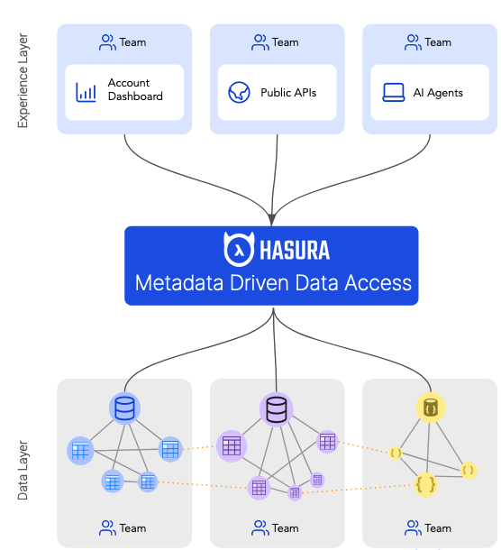
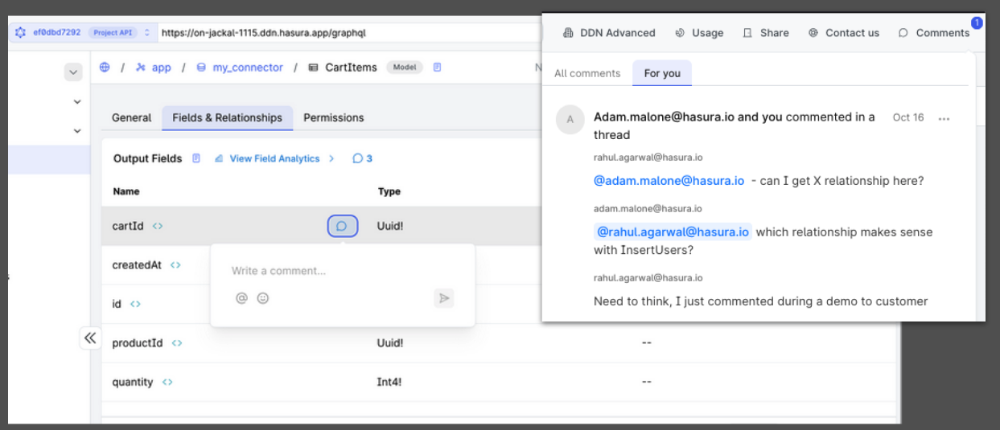
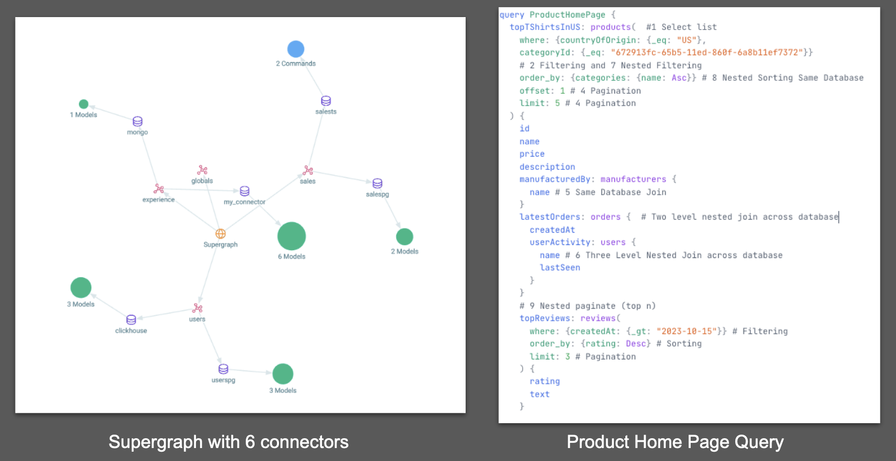
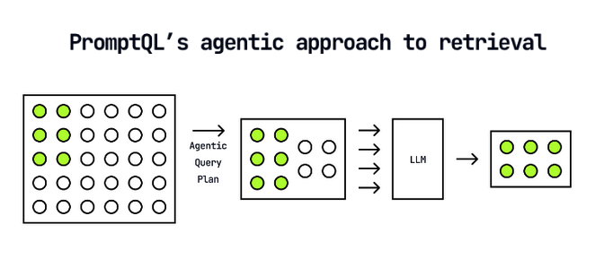
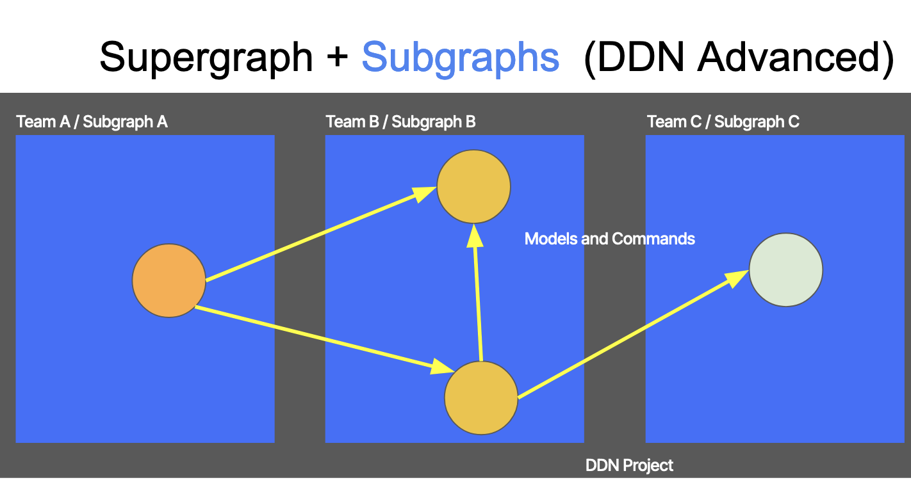

# ddn-cloudx

- Session Link - https://apiworld2024.sched.com/event/1i0N5
- Contact Details
  - Create Github Issues on the appropriate repository
  - rahul.a13@gmail.com, linkedin.com/in/rahulagarwal13

## Pre Requisites

- [Install Hasura CLI & Login](https://hasura.io/docs/3.0/cli/installation)
- [Install Docker](https://docs.docker.com/engine/install/), you'll need docker compose v2.27.1 or later.
- Keep your Anthropic API Key ready

## Introduction to Hasura DDN and Market Trends

Metadata-Centric Data Access: Discover how DDN’s declarative metadata model creates a unified, flexible data access layer that seamlessly integrates traditional databases and external services. This metadata-driven approach reduces the need for custom code, allowing teams to focus on high-impact areas, especially as AI technologies shift the development paradigm.
<!--  -->
   

## Chapter 1 - Greenfield Application (DDN Local Development)

- Google Docs/Figma Style Real time commenting 
- Github Repo: https://github.com/hasura/ddn-comments 
<!--   -->
   

## Chapter 2 - Sample Cloud `read-heavy` Application (DDN Cloud - Free and Base)

- Multi Region Ecommerce domain - Airbnb type scale app
- Github Repo: https://github.com/hasura/ddn-sample-app 
<!--    -->
   

### PromptQL Demo
- Creating an AI Assistant for your Github Repo
- https://promptql.hasura.io/docs/example-github 
<!--   -->
   

## Advanced Topics

### Chapter 3 - Multi Repo/ Multi Team Workflows (DDN Cloud Advanced)

- Indpendent Team CI/CD without breaking changes
- Watch Recording of this webinar for in depth [DDN Advanced Demo](https://hasura.io/events/webinar/hasura-v2-to-data-delivery-network-transforming-your-metadata-driven-data-access-story) 
  - Github Repos to replicate the demo - Start with Team 1 below: 
    - Team 1 - https://github.com/hasura/ddn-sample-app/tree/multirepo/team1admin 
    - Team 2 - https://github.com/hasura/ddn-federation-sample-team2 
<!--   -->
   

### Open Techincal RFCs for the DDN Platform
- Protobuf based API (Github Repo: https://github.com/hasura/grpc-api-experiments)
- [Distributed Entitlements based AuthZ System](https://github.com/hasura/graphql-engine/blob/abhinav/v3-authorization-rules-rfc/rfcs/v3/authorization-rules.md)

